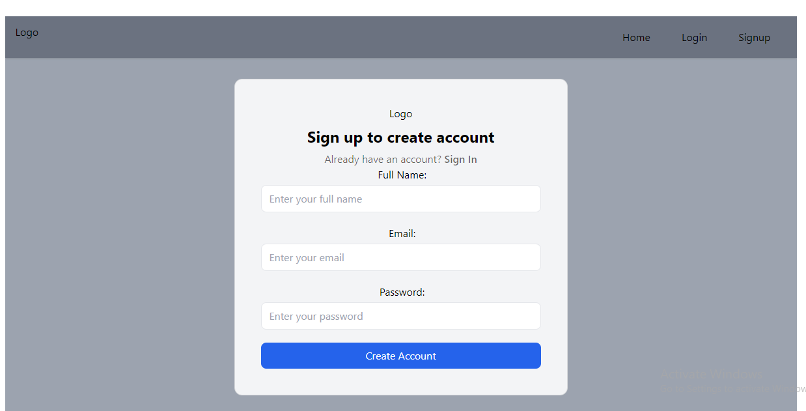
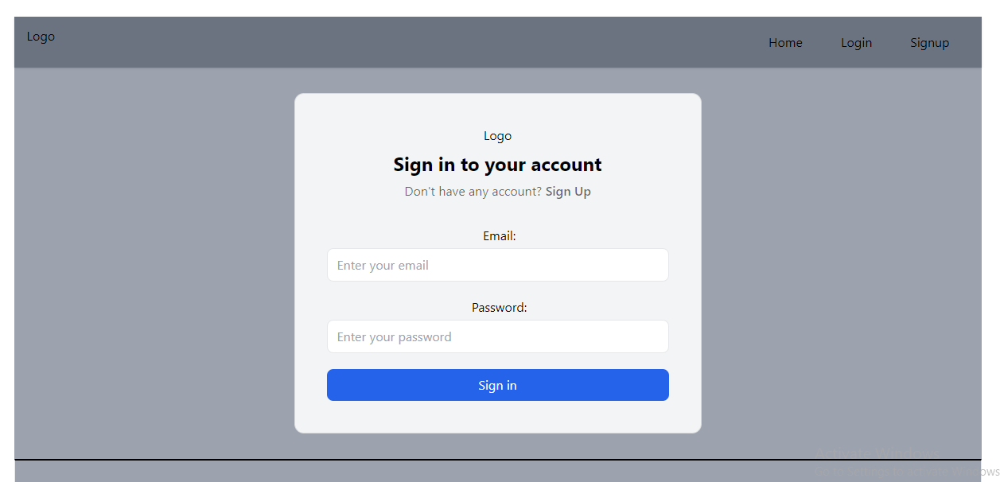
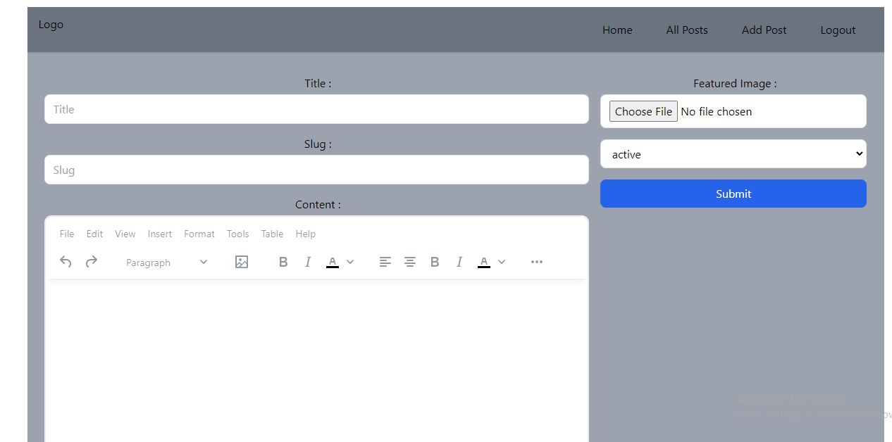
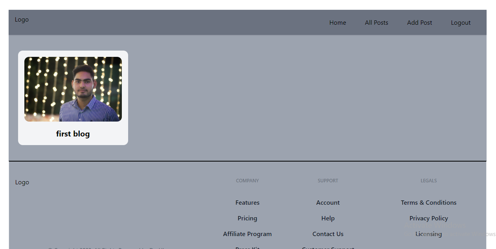

# Project Name

## Description

Webapp for writing your Articles of your choice

## Screenshots

## Built With

JAVASCRIPT, REACT, APPWRITE , and VSCODE 

## Prerequisites

Before using this project, you will need to install the following dependencies:

- [@reduxjs/toolkit](#)
- [@tinymce/tinymce-react](#)
- [appwrite](#)
- [html-react-parser](#)
- [react-hook-form](#)
- [react-redux](#)
- [react-router-dom](#)

## Installation

To install this project, follow these steps:

1. Clone the repository: `https://github.com/Ashdixit382/ArticleWebapp.git`
2. Install dependencies: `npm install`
3. Run the project: `npm run dev`

## Usage

To use this project, follow these steps:

1. Open the project in your preferred code editor.
2. Modify the code to fit your needs.
3. Run the project: `npm dev start`

## Contributing

If you'd like to contribute to this project, please fork the repository and make changes as you'd like. Pull requests are warmly welcome.
